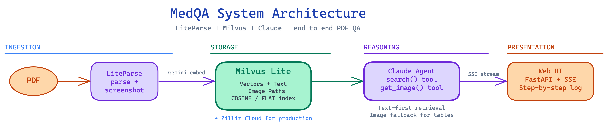
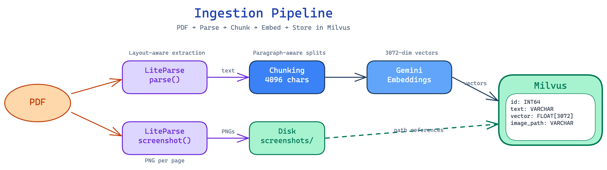
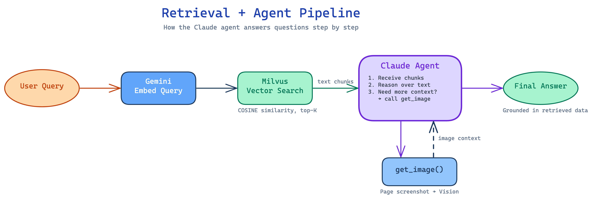

# ParseRAG

**Structure-aware PDF QA with LiteParse + Milvus + Claude**

ParseRAG is an end-to-end document question-answering system that handles structurally complex PDFs — tables, multi-column layouts, and visually grouped content — where naive text extraction fails. It separates parsing, retrieval, and reasoning into distinct layers, each handled by the right tool for the job.



## The Problem

PDF question-answering looks simple until you hit structured content. Consider a medication side-effects table where "depression" appears both as a reason for prescribing a drug *and* as a side effect of another. Once a parser flattens that table into a text stream, column identity is lost — and no amount of prompt engineering recovers it.

Most PDF QA systems conflate three concerns that should be separated:

| Approach | How it works | Problem |
|----------|-------------|---------|
| **Extract + Chunk** | Flatten PDF to text, chunk, embed, search | Loses table structure and column identity |
| **VLM Only** | Send page images to a vision model | Expensive per-page, degrades on long docs |
| **Separated Layers** (ParseRAG) | Dedicated parsing, retrieval, and reasoning | Each layer is independent, debuggable, scalable |

## Architecture

ParseRAG uses three specialized layers:

- **Parsing** — [LiteParse](https://github.com/run-llama/liteparse) extracts layout-aware text via spatial grid projection and renders page screenshots
- **Retrieval** — [Milvus](https://milvus.io/) stores text chunks with vector embeddings for similarity search
- **Reasoning** — [Claude](https://anthropic.com/claude) agent with tool-use decides when text is enough and when to look at the page image

### Ingestion Pipeline



1. **Parse** — LiteParse extracts layout-aware text per page, preserving column structure through spatial grid projection. No Markdown conversion — the LLM reads the spatial layout directly.
2. **Screenshot** — LiteParse renders high-resolution PNG screenshots of each page for visual fallback.
3. **Chunk** — Text is split into chunks (up to 4096 chars) respecting paragraph boundaries.
4. **Embed** — Each chunk is embedded using Google Gemini (`gemini-embedding-001`, 3072 dimensions).
5. **Store** — Chunks, vectors, and screenshot paths are stored in a Milvus collection with a COSINE similarity index.

**Milvus Schema:**

```
id:         INT64 (primary, auto-id)
text:       VARCHAR (chunk text)
vector:     FLOAT_VECTOR[3072] (Gemini embedding)
image_path: VARCHAR (path to page screenshot)
page_num:   INT64
```

### Retrieval + Agent Pipeline



When a user asks a question:

1. **Embed** — The query is embedded using the same Gemini model.
2. **Search** — Milvus performs COSINE similarity search, returning the top-K most relevant text chunks.
3. **Reason** — The Claude agent receives the chunks and decides:
   - If the text is sufficient → generate the answer
   - If the context is ambiguous or visual → call `get_image()` to retrieve the page screenshot and reason over the visual layout
4. **Answer** — The response is grounded strictly in retrieved content, not prior knowledge.

The agent has two tools:

| Tool | Purpose |
|------|---------|
| `search(query, limit)` | Vector similarity search in Milvus, returns text chunks + screenshot paths |
| `get_image(image_path)` | Retrieves the full-page screenshot for visual reasoning |

### Why Milvus

ParseRAG uses [Milvus Lite](https://milvus.io/docs/milvus_lite.md) for local development — a lightweight Python package that runs on your laptop with zero infrastructure. The same `pymilvus` API works across:

- **Milvus Lite** — Local file-based, great for prototyping
- **Milvus Standalone** — Single-server Docker deployment
- **Zilliz Cloud** — Fully managed, production-grade with 10x performance

To switch from local to cloud, you only change the connection URI:

```python
# Local
client = MilvusClient(uri="./milvus_lite.db")

# Zilliz Cloud
client = MilvusClient(
    uri="https://your-cluster.zillizcloud.com",
    token="your-api-key"
)
```

## Project Structure

```
parserag/
├── main.py                  # CLI: process, search, agent, eval
├── app.py                   # FastAPI server with SSE streaming
├── static/
│   └── index.html           # Web UI (editorial-style, step-by-step execution log)
├── src/
│   ├── processing.py        # PDF → Parse → Chunk → Embed → Milvus
│   ├── search.py            # Vector search + image retrieval
│   └── agent.py             # Claude agent with tool-use loop
├── data/
│   ├── Medication_Side_Effect_Flyer.pdf  # Sample PDF
│   └── gold.json            # 20-question eval suite (7 categories)
├── screenshots/             # Page PNGs rendered by LiteParse
├── diagrams/                # Architecture diagrams (Excalidraw)
└── requirements.txt
```

## Quick Start

### 1. Install dependencies

```bash
python3.12 -m venv venv
source venv/bin/activate
pip install pymilvus[milvus_lite] anthropic google-genai liteparse
pip install fastapi uvicorn
pip install 'setuptools<81'  # Required for milvus-lite compatibility
```

### 2. Set API keys

```bash
export GOOGLE_API_KEY="your-gemini-key"
export ANTHROPIC_API_KEY="your-anthropic-key"
```

### 3. Process the sample PDF

```bash
python main.py process data/Medication_Side_Effect_Flyer.pdf
```

### 4. Ask questions via CLI

```bash
python main.py agent "What category does Warfarin fall under?"
python main.py agent "Do blood thinners and cholesterol medications share any side effects?"
```

### 5. Launch the Web UI

```bash
uvicorn app:app --reload --port 8000
# Open http://localhost:8000
```

The web UI streams agent execution steps in real-time via Server-Sent Events (SSE), showing each thinking step, search query, and tool call as it happens.

## Web UI

The frontend uses an editorial newspaper-style design with:

- **Execution Log** (left panel) — Step-by-step cards showing the agent's thinking process, search queries, and tool calls with color-coded borders
- **Response** (right panel) — The final answer with formatted text
- **Stats Bar** — Steps, tool calls, searches, and image retrievals
- **Status Badge** — Shows whether the PDF has been processed

## Evaluation

The project includes a 20-question eval suite covering 7 categories:

| Category | Questions | Tests |
|----------|-----------|-------|
| Direct Lookup | 2 | Simple drug-to-category resolution |
| Synonym/Paraphrase | 4 | Mapping user language to PDF terminology |
| Brand/Generic | 3 | Resolving brand names to generics |
| Cross-Category | 3 | Comparing data across medication groups |
| Negation/Absence | 3 | Confirming something is NOT listed |
| Aggregation | 3 | Counting across the entire document |
| Disambiguation | 2 | Same term in different column roles |

```bash
python main.py eval --output results.json
```

## Tech Stack

| Component | Technology | Purpose |
|-----------|-----------|---------|
| PDF Parsing | [LiteParse](https://github.com/run-llama/liteparse) | Layout-aware text extraction + page screenshots |
| Vector Database | [Milvus](https://milvus.io/) / [Zilliz Cloud](https://zilliz.com/cloud) | Vector storage, similarity search, metadata filtering |
| Embeddings | [Google Gemini](https://ai.google.dev/) | `gemini-embedding-001`, 3072-dim vectors |
| Agent | [Claude](https://anthropic.com/claude) (Anthropic) | Tool-use reasoning with text + vision |
| Backend | [FastAPI](https://fastapi.tiangolo.com/) | SSE streaming API |
| Frontend | Vanilla HTML/CSS/JS | Single-file editorial UI |

## Diagrams

All architecture diagrams are in `diagrams/parserag-diagrams.excalidraw` — open in [Excalidraw](https://excalidraw.com/) to view and edit. The file contains 8 diagrams:

1. The PDF QA Problem
2. Three Approaches to PDF QA
3. LiteParse — Spatial Grid Projection
4. Ingestion Pipeline
5. Why Milvus Over Lightweight Alternatives
6. Retrieval + Agent Pipeline
7. Agent Tool-Use Loop (Traced)
8. ParseRAG System Architecture

## License

MIT
