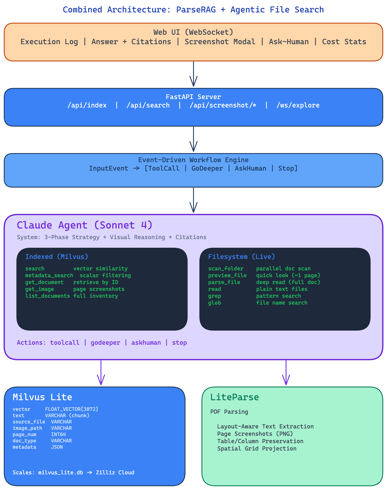

# ParseRAG

**Agentic PDF QA with LiteParse + Milvus + Claude**

ParseRAG is a document question-answering system that combines **indexed vector search** (Milvus) with **live filesystem exploration** (agentic file search) to answer questions about PDFs. It handles structurally complex documents — tables, multi-column layouts, and visually grouped content — where naive text extraction fails.

The agent has 8 tools and uses a three-phase exploration strategy (scan, deep dive, backtrack) to find answers across document collections.



## How It Works

ParseRAG separates parsing, retrieval, and reasoning into distinct layers:

- **Parsing** — [LiteParse](https://github.com/run-llama/liteparse) extracts layout-aware text via spatial grid projection and renders page screenshots
- **Retrieval** — [Milvus](https://github.com/milvus-io/milvus) stores text chunks with vector embeddings for cosine similarity search. Milvus is an open-source vector database built for scalable similarity search. [Zilliz Cloud](https://zilliz.com/cloud?utm_source=github&utm_medium=kol&utm_campaign=prompt_engineering_1) is the fully managed cloud service built on Milvus — same API, zero infrastructure, production-grade performance.
- **Reasoning** — Claude agent with 8 tools decides when to search the index, explore the filesystem, or examine page screenshots

### Dual Retrieval: Indexed + Filesystem

The agent operates in two modes that complement each other:

| Mode | Tools | When Used |
|------|-------|-----------|
| **Indexed Search** (fast) | `search`, `get_image` | Pre-indexed documents in Milvus. Sub-second vector similarity retrieval. |
| **Filesystem Exploration** (thorough) | `scan_folder`, `preview_file`, `parse_file`, `read_file`, `grep`, `glob` | Unindexed folders, cross-document analysis, or when search results are insufficient. |

The agent decides which mode to use based on the query — and can combine both in a single response.

### Agent Tools

| Tool | Category | Purpose |
|------|----------|---------|
| `search` | Indexed | Vector similarity search in Milvus. Returns text chunks + screenshot paths. |
| `get_image` | Indexed | Retrieve full-page screenshot for visual reasoning (tables, charts). |
| `scan_folder` | Filesystem | Parallel scan ALL documents in a folder (4 workers, 1500-char previews). |
| `preview_file` | Filesystem | Quick look at a single document (~first 2 pages, 3000 chars). |
| `parse_file` | Filesystem | Deep read — full content of a document via LiteParse. |
| `read_file` | Filesystem | Read plain text files (.txt, .md, .csv, .json). |
| `grep` | Filesystem | Regex pattern search within a file with line numbers + context. |
| `glob` | Filesystem | Find files matching a name pattern across a directory tree. |

### Three-Phase Exploration Strategy

When exploring unindexed documents, the agent follows a systematic strategy:

1. **Phase 1: Parallel Scan** — Use `scan_folder` to preview all documents at once. Categorize each as RELEVANT, MAYBE, or SKIP.
2. **Phase 2: Deep Dive** — Use `parse_file` on RELEVANT documents. Extract key information and watch for cross-references.
3. **Phase 3: Backtrack** — If a document references another that was SKIPPED, go back and parse it. Continue until all cross-references are resolved.

### Ingestion Pipeline

```
PDF Document
    |
    v
LiteParse (layout-aware text extraction + page screenshots)
    |
    +--> Text per page --> Chunk (4096 chars) --> Gemini Embed (3072-dim) --> Milvus Insert
    |
    +--> screenshots/{pdf_name}/page_N.png
```

**Milvus Collection Schema:**

```
id:          INT64 (primary, auto-id)
source_file: VARCHAR (PDF filename)
text:        VARCHAR (chunk text)
vector:      FLOAT_VECTOR[3072] (Gemini embedding)
image_path:  VARCHAR (path to page screenshot)
page_num:    INT64
```

### Why Milvus

[Milvus](https://milvus.io/zh?utm_source=github&utm_medium=kol&utm_campaign=prompt_engineering_1) is an open-source vector database purpose-built for AI applications. ParseRAG uses [Milvus Lite](https://milvus.io/docs/milvus_lite.md) for local development — a lightweight Python package that runs on your laptop with zero infrastructure. The same `pymilvus` API works across all deployment tiers with no code changes:

```python
# Local development (Milvus Lite)
client = MilvusClient(uri="./milvus_lite.db")

# Self-hosted (Milvus Standalone via Docker)
client = MilvusClient(uri="http://localhost:19530")

# Fully managed (Zilliz Cloud)
client = MilvusClient(uri="https://your-cluster.zillizcloud.com", token="your-api-key")
```

- **[Milvus Lite](https://milvus.io/docs/milvus_lite.md)** — Local file-based, great for prototyping and development
- **[Milvus Standalone](https://milvus.io/docs/prerequisite-docker.md)** — Single-server Docker deployment for production workloads
- **[Zilliz Cloud](https://zilliz.com/cloud?utm_source=github&utm_medium=kol&utm_campaign=prompt_engineering_1)** — Fully managed cloud service built on Milvus, zero ops, production-grade with 10x performance

## Quick Start

### 1. Install dependencies

```bash
python3.12 -m venv venv
source venv/bin/activate
pip install -r requirements.txt
pip install fastapi uvicorn
pip install 'setuptools<81'  # Required for milvus-lite compatibility
```

### 2. Set environment variables

```bash
export GOOGLE_API_KEY="your-gemini-api-key"
export ANTHROPIC_API_KEY="your-anthropic-api-key"
```

Optional configuration:

```bash
export CLAUDE_MODEL="claude-sonnet-4-20250514"    # Any Claude model with tool-use support
export EMBEDDING_MODEL="gemini-embedding-001"      # Google embedding model
export EMBEDDING_DIM="3072"                        # Embedding dimensions (must match model)
export MILVUS_DB_PATH="./milvus_lite.db"           # Milvus Lite database path
```

### 3. Index documents

```bash
# Single PDF
python main.py process data/Medication_Side_Effect_Flyer.pdf

# All PDFs in a directory
python main.py index data/documents
```

### 4. Ask questions via CLI

```bash
python main.py agent "What are the side effects of Warfarin?"
python main.py agent "Which medications require regular blood monitoring?"
```

### 5. Launch the Web UI

```bash
uvicorn app:app --reload --port 8000
# Open http://localhost:8000
```

## Web UI

The frontend uses an editorial newspaper-style design with real-time SSE streaming:

- **Folder Input** — Specify which directory to explore
- **Execution Log** (left panel) — Step-by-step cards showing agent actions with color-coded borders per tool type
- **Response** (right panel) — Final answer with clickable citations that open page screenshots
- **Stats Bar** — Steps, tool calls, searches, images, and filesystem exploration counts
- **Screenshot Modal** — Click any citation to view the original page screenshot

### Tool Step Colors

| Tool | Color |
|------|-------|
| `search` | Blue |
| `get_image` | Purple |
| `scan_folder` | Cyan |
| `parse_file` | Green |
| `preview_file` | Teal |
| `grep` | Amber |
| `glob` | Orange |
| `read_file` | Gray |
| Thinking | Amber |

## Project Structure

```
parserag/
├── main.py                  # CLI: process, index, search, agent, eval
├── app.py                   # FastAPI server with SSE streaming
├── static/
│   └── index.html           # Web UI (editorial-style, real-time execution log)
├── src/
│   ├── processing.py        # PDF -> Parse -> Chunk -> Embed -> Milvus
│   ├── search.py            # Vector search + image retrieval
│   ├── agent.py             # Claude agent with 8 tools + 3-phase strategy
│   └── fs.py                # Filesystem exploration tools (scan, grep, glob)
├── data/
│   ├── Medication_Side_Effect_Flyer.pdf  # Sample PDF
│   ├── documents/           # 16 medical PDFs for batch indexing
│   └── gold.json            # 20-question eval suite (7 categories)
├── screenshots/             # Page PNGs rendered by LiteParse
├── diagrams/                # Architecture diagrams (Excalidraw)
└── requirements.txt
```

## CLI Reference

| Command | Usage | Purpose |
|---------|-------|---------|
| `process` | `python main.py process <pdf_file>` | Parse, embed, and store a single PDF |
| `index` | `python main.py index <directory>` | Batch index all PDFs in a directory |
| `search` | `python main.py search <query> [-l N]` | Vector similarity search (no agent) |
| `agent` | `python main.py agent <query>` | Full agent loop with all 8 tools |
| `eval` | `python main.py eval [--output file]` | Run 20-question evaluation suite |

## Evaluation

The project includes a 20-question eval suite covering 7 categories:

| Category | Questions | Tests |
|----------|-----------|-------|
| Direct Lookup | 2 | Simple drug-to-category resolution |
| Synonym/Paraphrase | 4 | Mapping user language to PDF terminology |
| Brand/Generic | 3 | Resolving brand names to generics |
| Cross-Category | 3 | Comparing data across medication groups |
| Negation/Absence | 3 | Confirming something is NOT listed |
| Aggregation | 3 | Counting across the entire document |
| Disambiguation | 2 | Same term in different column roles |

```bash
python main.py eval --output results.json
```

## API Endpoints

| Endpoint | Method | Purpose |
|----------|--------|---------|
| `/` | GET | Serve Web UI |
| `/api/status` | GET | Check Milvus collection status (chunk count) |
| `/api/process` | POST | Process a single PDF |
| `/api/index` | POST | Index all PDFs in a directory |
| `/api/query` | POST | Stream agent execution via SSE |
| `/api/folders` | GET | List folders for the folder browser |
| `/api/screenshot/{path}` | GET | Serve page screenshot images |

## Tech Stack

| Component | Technology | Purpose |
|-----------|-----------|---------|
| PDF Parsing | [LiteParse](https://github.com/run-llama/liteparse) | Layout-aware text extraction + page screenshots |
| Vector Database | [Milvus](https://milvus.io/zh?utm_source=github&utm_medium=kol&utm_campaign=prompt_engineering_1) / [Zilliz Cloud](https://zilliz.com/cloud?utm_source=github&utm_medium=kol&utm_campaign=prompt_engineering_1) | Vector storage and similarity search |
| Embeddings | [Google Gemini](https://ai.google.dev/) | Text embeddings (configurable model + dimensions) |
| Agent | [Claude](https://anthropic.com/claude) (Anthropic) | Tool-use reasoning with text + vision |
| Backend | [FastAPI](https://fastapi.tiangolo.com/) | SSE streaming API |
| Frontend | Vanilla HTML/CSS/JS | Single-file editorial UI |

## Diagrams

Architecture diagrams for the system are in `diagrams/video-assets.excalidraw` — open in [Excalidraw](https://excalidraw.com/) to view and edit:

1. High-Level System Architecture
2. Ingestion Pipeline
3. Milvus Deep Dive (schema, scaling path, code examples)
4. Agent Tools (8 tools with fan-out visualization)
5. Dual Retrieval: Indexed vs Filesystem
6. Query-to-Answer RAG Flow
7. SSE Streaming Architecture

## License

MIT
